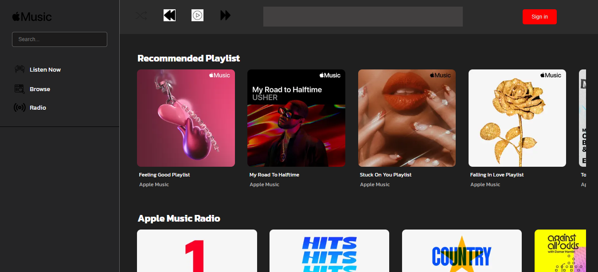
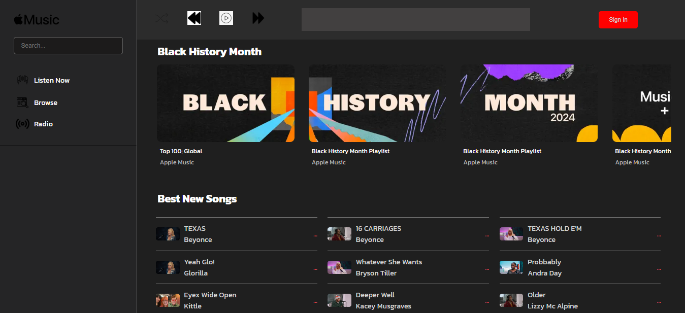
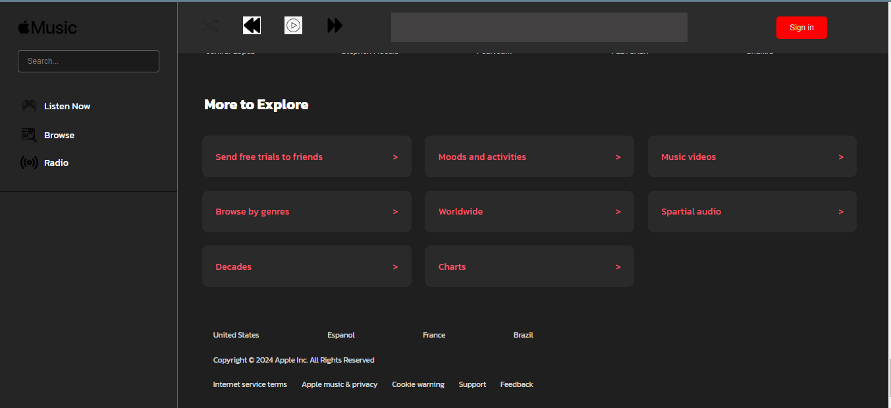

🍏 Apple Music Clone
This project is a simplified version of the Apple Music website, built using basic web technologies like HTML and CSS.

Description
The Apple Music Clone project aims to recreate the look and feel of the Apple Music website. It allows users to browse music, search for songs, and create playlists, just like the real site.

🖼️ Screenshots

🎥 Screen Recordings
[Watch Video](./screenshots/screen-record1.mp4)
[Watch Video](./screenshots/screen-record2.mp4)

Installation
Clone the repository: Click on the "Clone" or "Download" button on this page, or use the following command:
bash
Copy code
git clone <https://github.com/Hossanna/AppleMusic.git>
Install dependencies: Open the project folder in your terminal and run:

Copy code
npm install

## Usage

- **Open in Browser**: Once the server is running, open your web browser and go to `http://localhost:3000`.
- **Explore**: Click around the website to browse music, search for songs, and create playlists.
- **Enjoy**: Listen to your favourite tunes just like you would on Apple Music!

## 🤝 Contributing

This project was created by [Lawani-EJ](https://github.com/Lawani-EJ) and [Hosanna](https://github.com/Hossanna).

Contributions are welcome! Feel free to report bugs, suggest new features, or contribute code by submitting pull requests.

## 📝 License

This project is licensed under the [MIT License](LICENSE).

